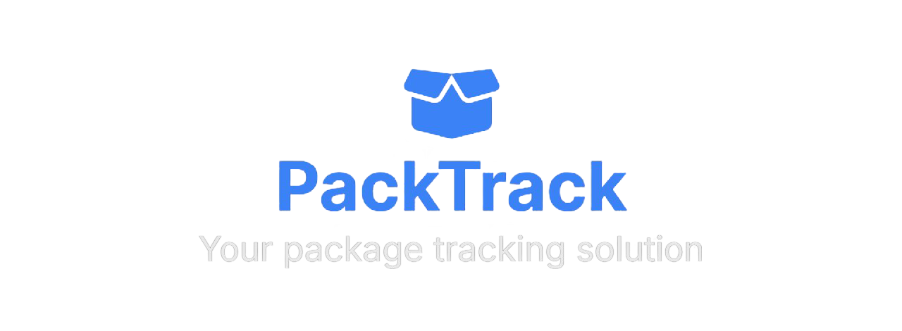

---



---

# PackTrack

> **PackTrack** is a lightweight web-based application designed to help users organize and track their personal deliveries in one centralized platform. It streamlines delivery tracking, provides packaging tips, and adds a fun touch with motivational quotes.

---

## 📌 Problem Statement

Managing online deliveries is often chaotic—tracking numbers are scattered across emails and SMS, leading to missed deliveries and confusion. **PackTrack** solves this with a centralized dashboard, real-time status tracking, and insightful packaging tips.

---

## 👥 Roles & Contributions  

Each team member contributed to different aspects of the project, ensuring a well-rounded and structured development process.  

| Team Member        | Responsibilities                                               |
|--------------------|----------------------------------------------------------------|
| **All Members**    | Planning & Requirement Gathering                               |
| **Rasha Al-Saleh** | Problem Statement, Business Case, Scope & Goals, UI Mockups    |
| **Sdra Awameh**    | SDLC Model, Gantt Chart                                        |
| **Dalaa Saqer**    | Functional Requirements, System Use Case Diagram               |

---

## 🔥 Core Features

### ✅ User Features

-  **JWT-secured User Registration & Login**
- **Dashboard** to manage deliveries
- **Add New Deliveries** (Courier, Tracking Number, Item Title, Expected Delivery Date)
- **View / Filter / Search / Sort** deliveries
- **Delivery Status Auto-Tracking** via Public API
- **Eco-friendly packaging tips**
- **Random Motivational Quotes**
- **Export Delivery Logs as PDF**

### 🔧 Admin Features

- **Admin Dashboard** for managing users & logs
- **Manually / Automatically Update Delivery Status**
- **User Management (Add/Remove Users)**
- **Generate Reports (Export as PDF)**

### 📊 Add-on Dashboard Charts
- **Delivery Status Summary**
- **Monthly Delivery Trends**
- **Top Couriers Used**

---

## 🛠 Tech Stack

| Layer          | Technologies                    |
|----------------|---------------------------------|
| Frontend       | HTML, CSS, JavaScript           |
| Backend        | PHP                             |
| Database       | MySQL                           |
| Authentication | JWT Tokens                      |
| DevOps         | GitHub Actions, Docker          |
| APIs Used      | TrackingMore API, Quotable API  |

---

## 🔗 API References

- [**TrackingMore API**](https://www.trackingmore.com/) (Real-time package tracking)
- [**Quotable API**](https://api.quotable.io/random) (Random quotes)

---

## 📂 Project Structure

```bash
PackTrack/ 
├── .github/ 
│   └── workflows/ 
│       └── ci-cd.yml 
├── apache/ 
│   └── apache.conf
├── backend/ 
│   ├── api/ 
│   │   ├── check-access.php
│   │   └── protectedRoute.php
│   ├── auth/
│   │   ├── login.php
│   │   ├── register.php
│   │   └── validateToken.php
│   ├── controllers/ 
│   ├── db/ 
│   │   └── db.php
│   ├── helpers/
│   │   └── response.php
│   ├── jwt/
│   │   └── JwtHandler.php
│   ├── middlewares/
│   │    └── authMiddleware.php
│   └── composer.json
├── frontend/ 
│   ├── assets/ 
│   │   ├── css/  
│   │   │   ├── loading.css
│   │   │   └── style.css
│   │   └── js/ 
│   │       ├── shared/
│   │       │   ├── notification.js
│   │       │   └── sidebar.js
│   │       ├── admin.js
│   │       ├── auth.js
│   │       ├── backend-conn.js
│   │       ├── dashboard.js
│   │       ├── script.js
│   │       └── style-switcher.js
│   └── views/
│       ├── errors/
│       │   ├── 403.html
│       │   ├── 404.html
│       │   └── 500.html
│       ├── shared/
│       │   ├── loading.html
│       │   ├── maintenance.html
│       │   └── sidebar.html
│       ├── admin-panel.html 
│       ├── dashboard.html 
│       └── index.html 
├── database/ 
│   └── PackTrackDB_users.sql
├── docker/ 
│   └── Dockerfile
├── docker-compose.yml 
├── Documents/
│   └── images/
├── .env
├── .htaccess
├── LICENSE
└── README.md
 ```

---

## ⚙️ Setup Instructions

### 💻 Local Setup
1. **Clone the Repository**

```bash
git clone https://github.com/rasha-2k/PackTrack.git
cd packtrack
```

2. **Copy `.env.example` and fill in credentials**

```bash
cp .env.example .env
```

> open the `.env` file and fill in the following details:
    - **DB credentials**: MySQL host, port, username, and password.
    - **JWT secret**: **Other API keys** (optional for tracking or quotes API)
3. **Database Set Up**
    - Configure your PHP/Apache local server 
    - Locate the `PackTrackDB_users.sql` file inside the `database/` folder. 
    - Import the SQL file into your local MySQL database using the following command:
```bash
mysql -u root -p PackTrackDB < database/PackTrackDB_users.sql
```
 
4. **Start Frontend**
    - Start from [index.html](http://localhost/frontend/views/index.html) (Login Page)

### 🐳 Optional: Docker Setup 

Instead of using a local server like XAMPP, use Docker for a consistent setup:

1. **Build Docker Images**: Build the `web` (backend + frontend) and `db` images using Docker Compose

```bash
docker-compose build
docker-compose up -d
```
> This will start the backend and the MySQL database on the specified ports.

2. **Verify containers are running**: Run the following command to check running containers:

```bash
docker ps
```

**Expected Output**:
- You should see at least two containers: one for the backend and one for the database.
- The STATUS column should show "Up" (e.g., Up 10 minutes).

**Example**:

```bash
CONTAINER ID   IMAGE           COMMAND        STATUS          PORTS                               NAMES
9d08b27b5631   packtrack-web   "php-apache"   Up 49 minutes   0.0.0.0:8080->80/tcp                packtrack-web-1
224b91db57c7   mysql:8.0       "docker-entry" Up 49 minutes   0.0.0.0:3306->3306/tcp, 33060/tcp   packtrack-db-1
```

3. Access the app at [http://localhost:8080/frontend/views/index.html](http://localhost:8080/frontend/views/index.html)

---

## 🌍 Environment Variables
```env
DB_HOST=db
DB_PORT=3306
DB_NAME=PackTrackDB
DB_USER=root
DB_PASS=your_database_password

ADMIN_SECRET=admin_secret_key

JWT_SECRET=your_secret_jwt_key

TRACKING_API_KEY=your_trackingmore_api_key
QUOTES_API_URL=https://api.quotable.io/random
```
---

## 🚀 DevOps & CI/CD

- **Automated Build & Deployment** via GitHub Actions.
- The `.github/workflows/ci-cd.yml` file defines the CI/CD steps, including:
    - Code linting and testing.
    - Docker image builds.
    - Deploy to the server automatically when new changes are merged.

> Workflow: `.github/workflows/ci-cd.yml`

---


## 📸 User Interface (Soon)

- ✅ Dashboard  
- ✅ Admin Panel  
- ✅ API Responses  
- ✅ PDF Export Example 

---

## 📞 Contact
> Email: [rasha.k.alsaleh@gmail.com](mailto:rasha.k.alsaleh@gmail.com) | LinkedIn: [@rasha-alsaleh](https://www.linkedin.com/in/rasha-alsaleh/) <br>
> Email: [awamehsdra@gmail.com](mailto:awamehsdra@gmail.com) | LinkedIn: [@sdra-awameh](https://www.linkedin.com/in/sdra-awameh-3b1391326/) <br>
> Email: [Saqerdalaa@gmail.com](mailto:Saqerdalaa@gmail.com) | LinkedIn: [@dalaa-saqer](https://www.linkedin.com/in/dalaa-saqer/)
---

## 👥 Contributors
<div style="display: flex; align-items: center; margin-bottom: 20px;">
    <a href="https://github.com/rasha-2k" style="text-decoration: none; display: flex; align-items: center;">
        
    </a>
    <a href="https://github.com/Sdra-Awameh" style="text-decoration: none; display: flex; align-items: center;">
        
    </a>
    <a href="https://github.com/dalaasaqer" style="text-decoration: none; display: flex; align-items: center;">
        
    </a>
</div>